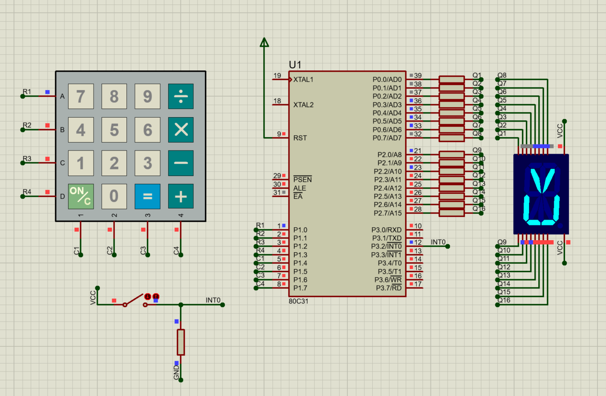

# Program for 8051 μ-controller

Implementation of controller for the safe. Developed with :
* *Keil ARM* - the complete software development environment for a wide range of Arm Cortex-M based microcontroller devices
* *Proteus Design Suite* - proprietary software tool suite used primarily for electronic design automations

### Features:

* code record
* code validation
* communication with user via numeric keyboard and 14 segment display

### Content:

* `diagram` - directory with files of *Proteus* project
* `driver` - directory with `driver.c` code and *Keil* project files

### Electrical diagram:

